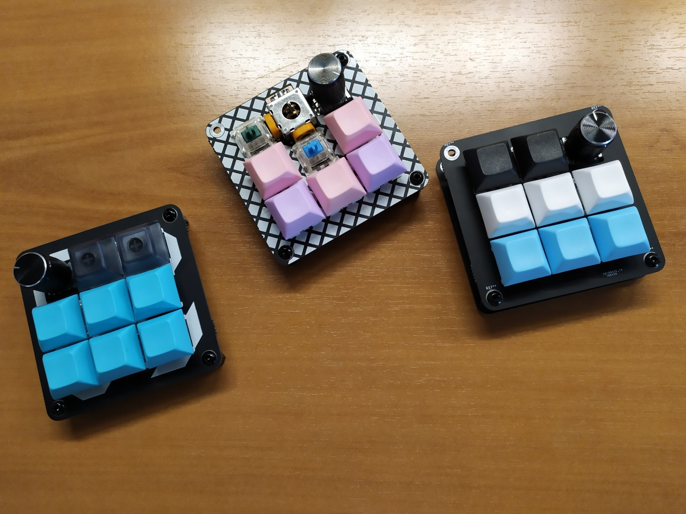

# Farewell

The Farewell is the cheapest 3x3 macropad I could make, with joystick and rotary encoder support.

The cost per unit is around $13 with switches, encoders, diodes and keycaps, for 10 units.

Disclaimer : This is not a final design. Problems identified following the first batch are listed in the "To do" section.

# Features
The PCB provides breakout front and back plate.
It supports : 
 * 9 switches (MX or Alps) in a 3x3 matrix
 * up to two rotary encoders at the top corner positions
 * one dual-axis joystick at the top center position
 * pro-micro footprint for the controller
 * choice of black or printed front and backplate
 * specific frontplate for joystick use

# To do
Here are the problems to be fixed for the second iteration : 
 * Make more space between switch footprints to allow joystick to tilt and keycaps to be mounted (implies non-standard switch spacing)
 * cut PCB corners to make space for standoffs
 * invert pro-micro footprint to have the usb port higher, preventing backplate from blocking cable
 * clean off silk printing from useless markings
 * print the FW on the front-plate in a more visible way (maybe)
 * enlarge a little bit the frontplate joystick cutout
 * move SDA pinhole to prevent confusion in rotary encoder positioning
 * mark back and front of the PCB
 
[Build instructions are available here](BuildInstructions_v1.md)
